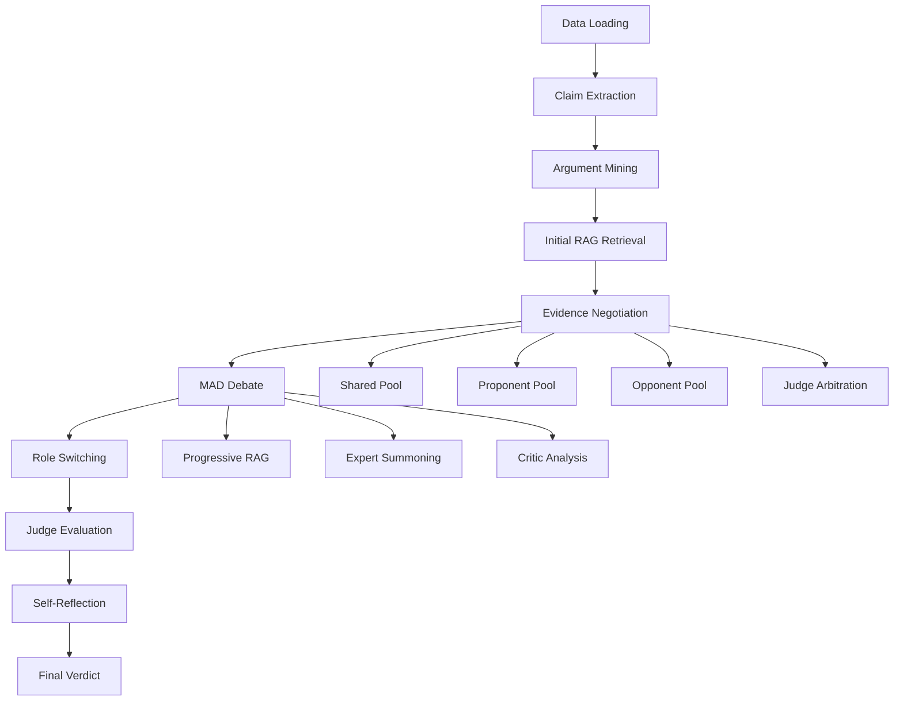
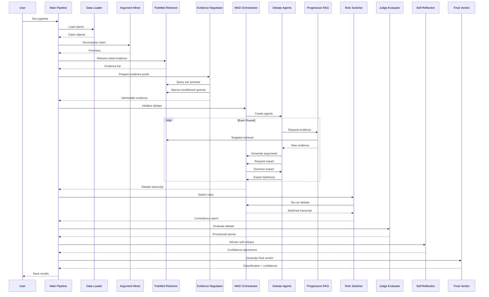

# PRAG Multi-Agent Debate Framework: Comprehensive Analysis Report

## Executive Summary

This framework implements a **PRAG (Premise-grounded RAG with Arbitration and Negotiation) Multi-Agent Debate System** for fact-checking COVID-19 claims using advanced multi-agent debate, role-switching, and progressive evidence retrieval. The system processes claims through 11 distinct stages, from data loading to final verdict generation, employing multiple LLMs in adversarial and collaborative roles.

---

## Framework Architecture Overview



---

## Pipeline Stages: Detailed Breakdown

### Stage 1: Data Loading
**File**: [`data_loader.py`](file:///d:/thesis/PRAG--ArgumentMining-MultiAgentDebate-RoleSwitching-CheckCOVID/framework/data_loader.py)

**Input**: 
- JSON/JSONL files from Check-COVID dataset
- Path: `Check-COVID/test/covidCheck_test_no_NEI.json`

**Process**:
- `DataLoader` class reads claims from structured files
- Supports both JSON arrays and JSONL (line-delimited JSON)
- Extracts claim ID, text, and metadata (label, evidence references)
- Handles multiple file formats with fallback parsing

**Output**:
- List of `Claim` objects with:
  - `id`: Unique claim identifier
  - `text`: The claim statement
  - `metadata`: Ground truth label and evidence IDs

**Performed by**: `DataLoader` class (automated file parsing)

---

### Stage 2: Preprocessing & Claim Extraction
**File**: [`preprocessing.py`](file:///d:/thesis/PRAG--ArgumentMining-MultiAgentDebate-RoleSwitching-CheckCOVID/framework/preprocessing.py)

**Input**: Raw claim text

**Process**:
- `ClaimExtractor` normalizes and cleans claim text
- Removes extraneous formatting
- Standardizes claim structure

**Output**: Cleaned `Claim` object

**Performed by**: `ClaimExtractor` class

---

### Stage 3: Argument Mining (Premise Decomposition)
**File**: [`agent_workflow.py`](file:///d:/thesis/PRAG--ArgumentMining-MultiAgentDebate-RoleSwitching-CheckCOVID/framework/agent_workflow.py)

**Input**: Extracted claim

**Process**:
- `ArgumentMiner` uses **DeepSeek-R1** (via OpenRouter) to decompose the claim
- LLM breaks down complex claims into atomic, testable premises
- Each premise represents a verifiable sub-statement
- Removes numbering and formatting artifacts

**Output**: 
- `Argument` object containing:
  - `claim_id`: Reference to original claim
  - `premises`: List of atomic premises (typically 5-7 items)

**Example** (from execution log):
```
Claim: "Young patients with COVID-19 can have sudden strokes with few to no prior risk factors."

Decomposed Premises:
1. Young patients can develop COVID-19
2. Strokes can occur in young patients
3. Strokes can occur in patients with COVID-19
4. Strokes can be sudden in young patients with COVID-19
5. Young patients with COVID-19 who experience strokes may have few to no traditional stroke risk factors
6. The incidence of strokes in young COVID-19 patients is higher than in young patients without COVID-19
7. Traditional stroke risk factors are often absent in young COVID-19 patients who experience strokes
```

**Performed by**: `ArgumentMiner` using **DeepSeek-R1** LLM

---

### Stage 4: Initial RAG Retrieval
**File**: [`rag_engine.py`](file:///d:/thesis/PRAG--ArgumentMining-MultiAgentDebate-RoleSwitching-CheckCOVID/framework/rag_engine.py)

**Input**: Original claim text

**Process**:
- `PubMedRetriever` performs semantic search using:
  - **FAISS index** (`pubmed_faiss.index`) - 1.4GB vector database
  - **Sentence-BERT** embeddings (all-MiniLM-L6-v2)
  - **PubMed metadata** (942k+ articles, 2020-2024)
- Query embedding is generated and compared against indexed vectors
- Top-K most similar articles retrieved (default K=5)
- Metadata includes: PMID, title, abstract, journal, year

**Output**:
- List of `Evidence` objects:
  - `text`: Article title + abstract excerpt
  - `source_id`: PubMed ID (PMID)
  - `relevance_score`: Cosine similarity score

**Performed by**: `PubMedRetriever` using FAISS vector search

---

### Stage 5: Evidence Negotiation & Arbitration
**File**: [`negotiation_engine.py`](file:///d:/thesis/PRAG--ArgumentMining-MultiAgentDebate-RoleSwitching-CheckCOVID/framework/negotiation_engine.py)

This is a **6-step procedure** implementing the PRAG methodology:

#### Step 5.1: Premise-Grounded Shared Retrieval
**Input**: Decomposed premises from Stage 3

**Process**:
- For each premise, query FAISS index independently
- Aggregate all results into a neutral evidence pool
- Deduplicate by source ID

**Output**: `shared_pool` (typically 12-15 evidence items)

#### Step 5.2: Stance-Conditioned Retrieval
**Input**: Original claim

**Process**:
- **Proponent query generation**: LLM creates query seeking supporting evidence
- **Opponent query generation**: LLM creates query seeking refuting evidence
- Each role retrieves K=3 perspective-specific articles

**Output**: 
- `proponent_pool` (3 items)
- `opponent_pool` (3 items)

#### Step 5.3: Evidence Pool Construction
**Process**: Organize evidence into three distinct pools with metadata

#### Step 5.4: Judge Arbitration
**Input**: All three evidence pools (18 total items)

**Process**:
- Judge evaluates each evidence item for:
  - **Relevance**: How well it addresses the claim
  - **Credibility**: Journal quality, methodology
- Assigns weight score (0-1) to each item
- Items with weight > 0.6 → **admissible**
- Items with weight 0.2-0.6 → **disputed**
- Items with weight < 0.2 → **excluded**

**Output**:
- `judge_state`:
  - `admissible_evidence`: List of high-weight items (typically 18)
  - `disputed_items`: List of questionable items

#### Step 5.5: Negotiation Injection
**Process**:
- Proponent reviews all pools, decides what to disclose/challenge
- Opponent reviews all pools, decides what to disclose/challenge
- Simulated negotiation dialogue (currently mocked)

#### Step 5.6: Final Evidence Set
**Output**: 
- Filtered list of admissible evidence for debate (18 items in example)
- Saved to `negotiation_state_{claim_id}.json`

**Performed by**: `EvidenceNegotiator` using **DeepSeek-R1** LLM

---

### Stage 6: Multi-Agent Debate (MAD) Initialization
**Files**: 
- [`mad_orchestrator.py`](file:///d:/thesis/PRAG--ArgumentMining-MultiAgentDebate-RoleSwitching-CheckCOVID/framework/mad_orchestrator.py)
- [`mad_system.py`](file:///d:/thesis/PRAG--ArgumentMining-MultiAgentDebate-RoleSwitching-CheckCOVID/framework/mad_system.py)
- [`personas.py`](file:///d:/thesis/PRAG--ArgumentMining-MultiAgentDebate-RoleSwitching-CheckCOVID/framework/personas.py)

**Input**: Admissible evidence from Stage 5

**Process**:
- Initialize `MADOrchestrator` with:
  - Claim
  - Admissible evidence pool
  - Progressive RAG engine
- Create debate agents with distinct personas:

| Role | LLM Provider | Model | Temperature | Expertise |
|------|--------------|-------|-------------|-----------|
| **Proponent** | OpenAI | gpt-5-mini | 0.5 | Scientific logic, clinical analysis |
| **Opponent** | OpenRouter | deepseek-v3.2 | 0.5 | Critical analysis, counter-argumentation |
| **Judge** | OpenRouter | qwen3-235b-a22b-2507 | 0.2 | Scientific oversight, evidence synthesis |
| **Critic** | OpenRouter | deepseek-v3.2 | 0.7 | Logical consistency, clinical methodology |
| **Expert (dynamic)** | OpenRouter | llama-3.1-405b | 0.5 | Domain-specific expertise (summoned as needed) |

**Output**: Initialized debate system with 4 core agents

**Performed by**: `MADOrchestrator` and `DebateAgent` classes

---

### Stage 7: Debate Proceedings (Multi-Round)
**File**: [`mad_orchestrator.py`](file:///d:/thesis/PRAG--ArgumentMining-MultiAgentDebate-RoleSwitching-CheckCOVID/framework/mad_orchestrator.py)

**Input**: Initialized MAD system

**Process** (per round):

#### Round Structure:
1. **Proponent Argument Generation**
   - Requests additional evidence via P-RAG if needed
   - Generates argument supporting the claim
   - Cites specific evidence by source ID

2. **Opponent Counter-Argument**
   - Requests counter-evidence via P-RAG
   - Generates rebuttal challenging the claim
   - Identifies methodological flaws

3. **Expert Summoning** (conditional)
   - Either side can request domain expert
   - Judge evaluates request and grants/denies
   - If granted, dynamic expert persona created
   - Expert provides technical testimony

4. **Critic Analysis**
   - Analyzes logical consistency of arguments
   - Identifies fallacies or weak reasoning
   - Provides neutral assessment

5. **Progressive RAG (P-RAG)**
   - Agents request targeted evidence mid-debate
   - LLM formulates context-aware queries
   - New evidence retrieved and integrated
   - Tracked in `prag_history.json`

6. **Judge Completion Check**
   - Judge determines if sufficient evidence presented
   - Decides whether to continue or conclude

**Termination Conditions**:
- Judge signals completion
- Maximum rounds reached (default: 5)

**Output**:
- `debate_transcript` with:
  - All arguments by round
  - Expert testimonies
  - Critic analyses
  - Evidence citations
- Saved to `debate_transcript.json`

**Example Flow** (from execution log):
```
Round 1:
  Proponent: Argues claim is supported (cites 32583169, 35380052, 34352787...)
  Opponent: Challenges methodology (cites 32852257, 35401913...)
  Expert: Infectious-disease epidemiologist supports proponent
  Critic: Analyzes logical structure

Round 2:
  Proponent: Reinforces with pathophysiology evidence
  Opponent: Questions causation vs correlation
  Expert: Vascular neurologist supports proponent
  Expert: Epidemiologist supports proponent
  Critic: Evaluates consistency

... (continues for 5 rounds)
```

**Performed by**: 
- `MADOrchestrator` (orchestration)
- `DebateAgent` instances (argument generation)
- `ProgressiveRAG` (evidence retrieval)

---

### Stage 8: Role-Switching Round
**File**: [`role_switcher.py`](file:///d:/thesis/PRAG--ArgumentMining-MultiAgentDebate-RoleSwitching-CheckCOVID/framework/role_switcher.py)

**Input**: Original debate transcript

**Process**:
1. **Role Swap**:
   - Proponent ↔ Opponent agents exchange roles
   - Agent that argued FOR now argues AGAINST
   - Agent that argued AGAINST now argues FOR

2. **Debate Reset**:
   - Clear debate transcript
   - Reset round counter
   - Maintain same evidence pool

3. **Re-run Debate**:
   - Execute 2 additional rounds with swapped roles
   - Agents must defend opposite position

4. **Consistency Analysis**:
   - Compare original vs switched arguments
   - Identify logical contradictions
   - Evaluate agent flexibility
   - Uses **Groq Llama-4-Maverick** for analysis

**Output**:
- `debate_transcript_switched.json`
- `role_switch_report.json` with:
  - Consistency score (0-10)
  - Identified contradictions
  - Analysis of argument quality

**Purpose**: Test if agents maintain logical consistency when forced to argue the opposite position

**Performed by**: `RoleSwitcher` using **Groq Llama-4-Maverick**

---

### Stage 9: Judge Evaluation
**File**: [`judge_evaluator.py`](file:///d:/thesis/PRAG--ArgumentMining-MultiAgentDebate-RoleSwitching-CheckCOVID/framework/judge_evaluator.py)

**Input**: Original debate transcript

**Process**:
- **Three independent judges** evaluate the debate:

| Judge | LLM | Focus Area |
|-------|-----|------------|
| Logic & Reasoning Expert | Groq Llama-4-Maverick | Argument structure, logical validity |
| Evidence Quality Expert | Groq Llama-3.3-70b | Source credibility, citation quality |
| Scientific Accuracy Expert | OpenAI GPT-4o-mini | Technical correctness, domain accuracy |

- Each judge scores both sides on 4 criteria:
  1. **Logical Coherence** (0-10)
  2. **Evidence Quality** (0-10)
  3. **Rebuttal Strength** (0-10)
  4. **Technical Accuracy** (0-10)

- **Aggregate Scoring**:
  - Sum scores across all judges
  - Side with higher total = provisional winner
  - Calculate confidence based on score margin

**Output**:
- `judge_evaluation.json` with:
  - `provisional_winner`: "proponent" or "opponent"
  - Individual judge scores and reasoning
  - Aggregate scores
  - Confidence level

**Example** (from execution log):
```
Judge 1: Opponent wins (Proponent: 28, Opponent: 28)
Judge 2: Opponent wins (Proponent: 28, Opponent: 28)
Judge 3: Opponent wins (Proponent: 28, Opponent: 28)

Provisional Winner: opponent
Aggregate Scores - Proponent: 84, Opponent: 84
Confidence: 0.000
```

**Performed by**: `JudgeEvaluator` with 3 independent LLM judges

---

### Stage 10: Self-Reflection Round
**File**: [`self_reflection.py`](file:///d:/thesis/PRAG--ArgumentMining-MultiAgentDebate-RoleSwitching-CheckCOVID/framework/self_reflection.py)

**Input**: 
- Provisional winner from Stage 9
- Winner's arguments
- Opponent's critiques

**Process**:
1. **Extract Winner's Arguments**:
   - Collect all arguments made by winning side
   - Compile opponent's counter-arguments

2. **Self-Critique Prompt**:
   - Winner's LLM reviews its own arguments
   - Identifies logical flaws
   - Acknowledges valid opponent points
   - Assesses evidence misinterpretations

3. **Confidence Adjustment**:
   - Winner provides self-assessment
   - Adjusts confidence by ±0.3 based on reflection
   - Typically decreases after acknowledging weaknesses

**Output**:
- `self_reflection.json` with:
  - Winner's original arguments
  - Opponent's critiques
  - Self-reflection text
  - Confidence adjustment (-0.3 to +0.3)

**Example** (from execution log):
```
Winner: Scientific Proponent (opponent)
Confidence adjustment: -0.05
```

**Performed by**: Winning agent's LLM (self-critique)

---

### Stage 11: Final Verdict Generation
**File**: [`final_verdict.py`](file:///d:/thesis/PRAG--ArgumentMining-MultiAgentDebate-RoleSwitching-CheckCOVID/framework/final_verdict.py)

**Input**:
- Debate transcript
- Judge evaluation results
- Role-switching consistency report
- Self-reflection results

**Process**:

#### Confidence Calculation:
```python
base_confidence = 0.5  # Neutral starting point

# Factor 1: Judge consensus (0.0 - 0.4)
score_margin = abs(proponent_score - opponent_score)
total_possible = max_score_per_judge * num_judges
judge_factor = (score_margin / total_possible) * 0.4

# Factor 2: Role-switch consistency (0.0 - 0.2)
consistency_factor = consistency_score / 10 * 0.2

# Factor 3: Self-reflection adjustment (-0.3 to +0.3)
reflection_adjustment = reflection_result['confidence_adjustment']

# Final confidence
confidence = base_confidence + judge_factor + consistency_factor + reflection_adjustment
confidence = clamp(confidence, 0.0, 1.0)
```

#### Verdict Determination:
- If `provisional_winner == "proponent"` → **SUPPORT**
- If `provisional_winner == "opponent"` → **REFUTE**

#### Reasoning Chain:
- Extracts key evidence cited
- Summarizes winning arguments
- Identifies critical turning points
- Explains confidence level

**Output**:
- `final_verdict.json` with:
  - `verdict`: "SUPPORT" or "REFUTE"
  - `confidence`: 0.0 - 1.0
  - `reasoning`: Explanation chain
  - `ground_truth_label`: From metadata
  - `correct`: Boolean (verdict matches ground truth)
  - `key_evidence`: List of cited sources
  - `total_evidence_used`: Count

**Example** (from execution log):
```json
{
  "claim_id": "60ac6953f9b9e03ea4d8e692_1",
  "verdict": "REFUTE",
  "confidence": 0.152,
  "ground_truth": "SUPPORT",
  "correct": false
}
```

**Saved to**: `outcome/all_verdicts.jsonl` (appended)

**Performed by**: `FinalVerdict` class (algorithmic aggregation)

---

## Data Flow Summary

### Input Data
```
Check-COVID Dataset
├── test/covidCheck_test_no_NEI.json
│   ├── Claim ID
│   ├── Claim Text
│   ├── Ground Truth Label
│   └── Evidence References
```

### Intermediate Artifacts
```
framework/
├── negotiation_state_{claim_id}.json     # Evidence pools + judge state
├── debate_transcript.json                # Original debate
├── debate_transcript_switched.json       # Role-switched debate
├── prag_history.json                     # Progressive RAG queries
├── role_switch_report.json               # Consistency analysis
├── judge_evaluation.json                 # Multi-judge scores
├── self_reflection.json                  # Winner's self-critique
└── final_verdict.json                    # Final classification
```

### Output Data
```
outcome/
├── all_verdicts.jsonl                    # Aggregated results
├── processed_claims.txt                  # Claim IDs processed
└── logs/
    └── execution_log_{claim_id}.txt      # Full execution trace
```

---

## LLM Model Assignment

### Core Debate Agents
| Role | Provider | Model | Purpose |
|------|----------|-------|---------|
| Premise Decomposition | OpenRouter | deepseek/deepseek-r1 | Break claims into testable premises |
| Proponent | OpenAI | gpt-5-mini | Argue in favor of claim |
| Opponent | OpenRouter | deepseek/deepseek-v3.2 | Argue against claim |
| Judge (Moderator) | OpenRouter | qwen/qwen3-235b-a22b-2507 | Oversee debate, determine completion |
| Critic | OpenRouter | deepseek/deepseek-v3.2 | Analyze logical consistency |

### Evaluation Judges
| Judge | Provider | Model | Expertise |
|-------|----------|-------|-----------|
| Logic & Reasoning | Groq | llama-4-maverick-17b-128e | Argument structure |
| Evidence Quality | Groq | llama-3.3-70b-versatile | Source credibility |
| Scientific Accuracy | OpenAI | gpt-4o-mini | Technical correctness |

### Dynamic Experts
| Type | Provider | Model | Summoned When |
|------|----------|-------|---------------|
| Domain Experts | OpenRouter | llama-3.1-405b-instruct | Agents request specialized knowledge |

### Utility LLMs
| Task | Provider | Model |
|------|----------|-------|
| Consistency Analysis | Groq | llama-4-maverick-17b-128e |
| Evidence Weighting | OpenRouter | deepseek-r1 |
| Query Formulation | OpenRouter | deepseek-r1 |

---

## Key Features & Innovations

### 1. **PRAG Methodology**
- **Premise-grounded retrieval**: Decomposes claims before evidence search
- **Stance-conditioned pools**: Separate evidence for each perspective
- **Judge arbitration**: Pre-debate evidence filtering

### 2. **Progressive RAG (P-RAG)**
- Agents request evidence **during** debate, not just before
- Context-aware query formulation
- Tracks retrieval history for transparency

### 3. **Role-Switching Mechanism**
- Forces agents to argue opposite positions
- Tests logical consistency and adaptability
- Identifies confirmation bias

### 4. **Multi-Judge Evaluation**
- Three independent LLM judges
- Diverse evaluation criteria
- Reduces single-model bias

### 5. **Self-Reflection**
- Winner critiques own arguments
- Acknowledges opponent's valid points
- Adjusts confidence based on introspection

### 6. **Dynamic Expert Summoning**
- Agents can request domain experts mid-debate
- Judge approves/denies requests
- Experts provide specialized testimony

---

## Execution Metrics (Example Run)

**Claim**: "Young patients with COVID-19 can have sudden strokes with few to no prior risk factors."

| Metric | Value |
|--------|-------|
| **Decomposed Premises** | 7 |
| **Initial Evidence Retrieved** | 5 |
| **Shared Pool Size** | 12 |
| **Proponent Pool Size** | 3 |
| **Opponent Pool Size** | 3 |
| **Admissible Evidence** | 18 |
| **Debate Rounds** | 5 |
| **Expert Testimonies** | 6 (3 proponent, 3 opponent) |
| **P-RAG Retrievals** | Multiple per round |
| **Role-Switch Rounds** | 2 (network errors occurred) |
| **Final Verdict** | REFUTE |
| **Confidence** | 0.152 |
| **Ground Truth** | SUPPORT |
| **Correct** | ❌ False |

---

## File Structure

### Core Pipeline
- [`main_pipeline.py`](file:///d:/thesis/PRAG--ArgumentMining-MultiAgentDebate-RoleSwitching-CheckCOVID/framework/main_pipeline.py) - Orchestrates all 11 stages
- [`models.py`](file:///d:/thesis/PRAG--ArgumentMining-MultiAgentDebate-RoleSwitching-CheckCOVID/framework/models.py) - Data classes (Claim, Evidence, Argument, DebateState)

### Data & Retrieval
- [`data_loader.py`](file:///d:/thesis/PRAG--ArgumentMining-MultiAgentDebate-RoleSwitching-CheckCOVID/framework/data_loader.py) - Load claims from JSON/JSONL
- [`rag_engine.py`](file:///d:/thesis/PRAG--ArgumentMining-MultiAgentDebate-RoleSwitching-CheckCOVID/framework/rag_engine.py) - FAISS-based retrieval (SimpleRetriever, VectorRetriever, PubMedRetriever)
- [`build_faiss.py`](file:///d:/thesis/PRAG--ArgumentMining-MultiAgentDebate-RoleSwitching-CheckCOVID/framework/build_faiss.py) - Build FAISS index from PubMed corpus

### Argument Mining
- [`preprocessing.py`](file:///d:/thesis/PRAG--ArgumentMining-MultiAgentDebate-RoleSwitching-CheckCOVID/framework/preprocessing.py) - Claim extraction/normalization
- [`agent_workflow.py`](file:///d:/thesis/PRAG--ArgumentMining-MultiAgentDebate-RoleSwitching-CheckCOVID/framework/agent_workflow.py) - ArgumentMiner (premise decomposition)

### Evidence Negotiation
- [`negotiation_engine.py`](file:///d:/thesis/PRAG--ArgumentMining-MultiAgentDebate-RoleSwitching-CheckCOVID/framework/negotiation_engine.py) - EvidenceNegotiator (6-step PRAG procedure)

### Multi-Agent Debate
- [`mad_orchestrator.py`](file:///d:/thesis/PRAG--ArgumentMining-MultiAgentDebate-RoleSwitching-CheckCOVID/framework/mad_orchestrator.py) - MADOrchestrator (debate coordination)
- [`mad_system.py`](file:///d:/thesis/PRAG--ArgumentMining-MultiAgentDebate-RoleSwitching-CheckCOVID/framework/mad_system.py) - DebateAgent (individual agent logic)
- [`personas.py`](file:///d:/thesis/PRAG--ArgumentMining-MultiAgentDebate-RoleSwitching-CheckCOVID/framework/personas.py) - Agent persona definitions and LLM assignments
- [`prag_engine.py`](file:///d:/thesis/PRAG--ArgumentMining-MultiAgentDebate-RoleSwitching-CheckCOVID/framework/prag_engine.py) - ProgressiveRAG (mid-debate retrieval)

### Evaluation & Verdict
- [`role_switcher.py`](file:///d:/thesis/PRAG--ArgumentMining-MultiAgentDebate-RoleSwitching-CheckCOVID/framework/role_switcher.py) - RoleSwitcher (consistency testing)
- [`judge_evaluator.py`](file:///d:/thesis/PRAG--ArgumentMining-MultiAgentDebate-RoleSwitching-CheckCOVID/framework/judge_evaluator.py) - JudgeEvaluator (multi-judge scoring)
- [`self_reflection.py`](file:///d:/thesis/PRAG--ArgumentMining-MultiAgentDebate-RoleSwitching-CheckCOVID/framework/self_reflection.py) - SelfReflection (winner self-critique)
- [`final_verdict.py`](file:///d:/thesis/PRAG--ArgumentMining-MultiAgentDebate-RoleSwitching-CheckCOVID/framework/final_verdict.py) - FinalVerdict (confidence-weighted classification)

### LLM Clients
- [`llm_client.py`](file:///d:/thesis/PRAG--ArgumentMining-MultiAgentDebate-RoleSwitching-CheckCOVID/framework/llm_client.py) - Base LLM interface
- [`openai_client.py`](file:///d:/thesis/PRAG--ArgumentMining-MultiAgentDebate-RoleSwitching-CheckCOVID/framework/openai_client.py) - OpenAI API client
- [`openrouter_client.py`](file:///d:/thesis/PRAG--ArgumentMining-MultiAgentDebate-RoleSwitching-CheckCOVID/framework/openrouter_client.py) - OpenRouter API client
- [`groq_client.py`](file:///d:/thesis/PRAG--ArgumentMining-MultiAgentDebate-RoleSwitching-CheckCOVID/framework/groq_client.py) - Groq API client
- [`ollama_client.py`](file:///d:/thesis/PRAG--ArgumentMining-MultiAgentDebate-RoleSwitching-CheckCOVID/framework/ollama_client.py) - Ollama local client

### Utilities
- [`expertise_extractor.py`](file:///d:/thesis/PRAG--ArgumentMining-MultiAgentDebate-RoleSwitching-CheckCOVID/framework/expertise_extractor.py) - Extract expert domains
- [`query_faiss.py`](file:///d:/thesis/PRAG--ArgumentMining-MultiAgentDebate-RoleSwitching-CheckCOVID/framework/query_faiss.py) - Test FAISS queries
- [`filter_years.py`](file:///d:/thesis/PRAG--ArgumentMining-MultiAgentDebate-RoleSwitching-CheckCOVID/framework/filter_years.py) - Filter PubMed by year

---

## Technical Dependencies

### Vector Database
- **FAISS** (Facebook AI Similarity Search)
  - Index: `pubmed_faiss.index` (1.4 GB)
  - Metadata: `pubmed_meta.jsonl` (1.0 GB)
  - Offsets: `pubmed_meta_offsets.npy` (7.5 MB)
  - Total documents: ~942,000 PubMed articles (2020-2024)

### Embedding Model
- **Sentence-BERT**: `sentence-transformers/all-MiniLM-L6-v2`
  - Dimension: 384
  - Normalized embeddings for cosine similarity

### LLM Providers
- **OpenAI**: GPT-5-mini, GPT-4o-mini
- **OpenRouter**: DeepSeek-R1, DeepSeek-v3.2, Qwen3-235b, Llama-3.1-405b
- **Groq**: Llama-4-Maverick, Llama-3.3-70b

---

## Execution Flow Diagram



---

## Conclusion

This framework represents a sophisticated multi-agent fact-checking system that combines:
- **Advanced retrieval**: FAISS-indexed PubMed corpus with 942k+ articles
- **Structured argumentation**: Premise decomposition and evidence negotiation
- **Adversarial debate**: Multiple LLMs in proponent/opponent roles
- **Progressive evidence**: Mid-debate retrieval based on context
- **Consistency testing**: Role-switching to detect bias
- **Multi-perspective evaluation**: Three independent judge LLMs
- **Self-awareness**: Winner performs self-critique

The system processes claims through 11 distinct stages, generating comprehensive audit trails and confidence-weighted verdicts for COVID-19 fact-checking.
