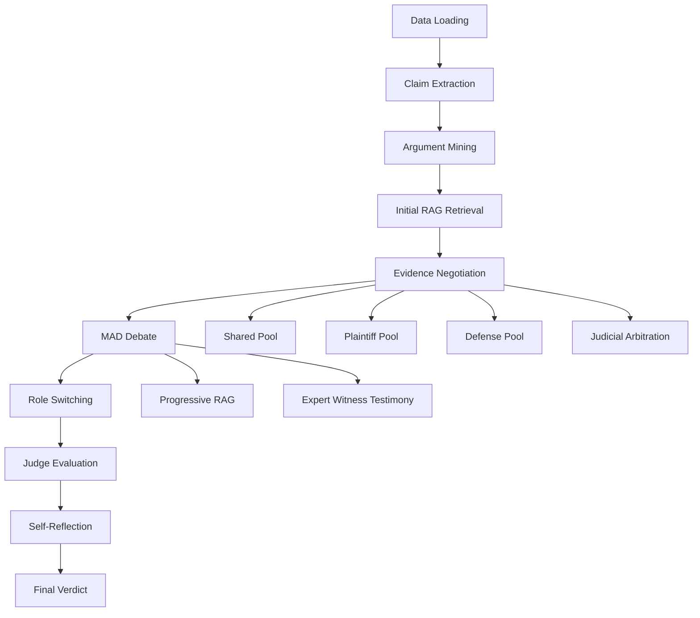
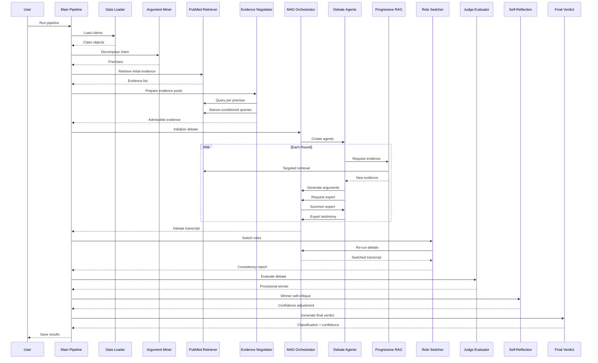

# PRAG Multi-Agent Debate Framework: Comprehensive Analysis Report

## Executive Summary

This framework implements a **PRAG (Premise-grounded RAG with Arbitration and Negotiation) Multi-Agent Debate System** for fact-checking COVID-19 claims using advanced multi-agent debate, role-switching, and progressive evidence retrieval. The system processes claims through 11 distinct stages, from data loading to final verdict generation, employing multiple LLMs in adversarial and collaborative roles.

---

## Framework Architecture Overview



---

## Pipeline Stages: Detailed Breakdown

### Stage 1: Data Loading
**File**: [`data_loader.py`](file:///d:/thesis/PRAG--ArgumentMining-MultiAgentDebate-RoleSwitching-CheckCOVID/framework/data_loader.py)

**Input**: 
- JSON/JSONL files from Check-COVID dataset
- Path: `Check-COVID/test/covidCheck_test_no_NEI.json`

**Process**:
- `DataLoader` class reads claims from structured files
- Supports both JSON arrays and JSONL (line-delimited JSON)
- Extracts claim ID, text, and metadata (label, evidence references)
- Handles multiple file formats with fallback parsing

**Output**:
- List of `Claim` objects with:
  - `id`: Unique claim identifier
  - `text`: The claim statement
  - `metadata`: Ground truth label and evidence IDs

**Performed by**: `DataLoader` class (automated file parsing)

---

### Stage 2: Preprocessing & Claim Extraction
**File**: [`preprocessing.py`](file:///d:/thesis/PRAG--ArgumentMining-MultiAgentDebate-RoleSwitching-CheckCOVID/framework/preprocessing.py)

**Input**: Raw claim text

**Process**:
- `ClaimExtractor` normalizes and cleans claim text
- Removes extraneous formatting
- Standardizes claim structure

**Output**: Cleaned `Claim` object

**Performed by**: `ClaimExtractor` class

---

### Stage 3: Argument Mining (Premise Decomposition)
**File**: [`agent_workflow.py`](file:///d:/thesis/PRAG--ArgumentMining-MultiAgentDebate-RoleSwitching-CheckCOVID/framework/agent_workflow.py)

**Input**: Extracted claim

**Process**:
- `ArgumentMiner` uses **DeepSeek-R1** (via OpenRouter) to decompose the claim
- LLM breaks down complex claims into atomic, testable premises
- Each premise represents a verifiable sub-statement
- Removes numbering and formatting artifacts

**Output**: 
- `Argument` object containing:
  - `claim_id`: Reference to original claim
  - `premises`: List of atomic premises (typically 5-7 items)

**Example** (from execution log):
```
Claim: "Young patients with COVID-19 can have sudden strokes with few to no prior risk factors."

Decomposed Premises:
1. Young patients can develop COVID-19
2. Strokes can occur in young patients
3. Strokes can occur in patients with COVID-19
4. Strokes can be sudden in young patients with COVID-19
5. Young patients with COVID-19 who experience strokes may have few to no traditional stroke risk factors
6. The incidence of strokes in young COVID-19 patients is higher than in young patients without COVID-19
7. Traditional stroke risk factors are often absent in young COVID-19 patients who experience strokes
```

**Performed by**: `ArgumentMiner` using **DeepSeek-R1** LLM

---

### Stage 4: Initial RAG Retrieval
**File**: [`rag_engine.py`](file:///d:/thesis/PRAG--ArgumentMining-MultiAgentDebate-RoleSwitching-CheckCOVID/framework/rag_engine.py)

**Input**: Original claim text

**Process**:
- `PubMedRetriever` performs semantic search using:
  - **FAISS index** (`pubmed_faiss.index`) - 1.4GB vector database
  - **Sentence-BERT** embeddings (all-MiniLM-L6-v2)
  - **PubMed metadata** (942k+ articles, 2020-2024)
- Query embedding is generated and compared against indexed vectors
- Top-K most similar articles retrieved (default K=5)
- Metadata includes: PMID, title, abstract, journal, year

**Output**:
- List of `Evidence` objects:
  - `text`: Article title + abstract excerpt
  - `source_id`: PubMed ID (PMID)
  - `relevance_score`: Cosine similarity score

**Performed by**: `PubMedRetriever` using FAISS vector search

---

### Stage 5: Evidence Negotiation & Arbitration
**File**: [`negotiation_engine.py`](file:///d:/thesis/PRAG--ArgumentMining-MultiAgentDebate-RoleSwitching-CheckCOVID/framework/negotiation_engine.py)

This is a **6-step procedure** implementing the PRAG methodology:

#### Step 5.1: Premise-Grounded Shared Retrieval
**Input**: Decomposed premises from Stage 3

**Process**:
- For each premise, query FAISS index independently
- Aggregate all results into a neutral evidence pool
- Deduplicate by source ID

**Output**: `shared_pool` (typically 12-15 evidence items)

#### Step 5.2: Stance-Conditioned Retrieval
**Input**: Original claim

**Process**:
- **Plaintiff query generation**: LLM creates query seeking supporting evidence
- **Defense query generation**: LLM creates query seeking refuting evidence
- Each role retrieves K=3 perspective-specific articles

**Output**: 
- `plaintiff_pool` (3 items)
- `defense_pool` (3 items)

#### Step 5.3: Evidence Pool Construction
**Process**: Organize evidence into three distinct pools with metadata

#### Step 5.4: Judicial Arbitration
**Input**: All three evidence pools (18 total items)

**Process**:
- Judge evaluates each evidence item for:
  - **Relevance**: How well it addresses the claim
  - **Credibility**: Journal quality, methodology
- Assigns weight score (0-1) to each item
- Items with weight > 0.6 → **admissible**
- Items with weight 0.2-0.6 → **disputed**
- Items with weight < 0.2 → **excluded**

**Output**:
- `judge_state`:
  - `admissible_evidence`: List of high-weight items (typically 18)
  - `disputed_items`: List of questionable items

#### Step 5.5: Negotiation Injection & Discovery Refinement
**Process**:
- Plaintiff Counsel reviews all pools, decides what to disclose/challenge.
- Defense Counsel reviews all pools, decides what to disclose/challenge.
- **Adaptive Query Refinement**: The Court oversees evidence discovery requests, refining counsel queries for precision and scientific rigor.

#### Step 5.6: Final Evidence Set
**Output**: 
- Filtered list of admissible evidence for proceedings.
- **Novelty Scoring**: Each exhibit is assigned a novelty score (1 - max cosine similarity to existing pool) to prevent redundant discovery.
- Saved to `negotiation_state_{claim_id}.json`.

**Performed by**: `EvidenceNegotiator` using **DeepSeek-R1** LLM and embedding-based similarity checks.

---

### Stage 6: Multi-Agent Debate (MAD) Initialization
**Files**: 
- [`mad_orchestrator.py`](file:///d:/thesis/PRAG--ArgumentMining-MultiAgentDebate-RoleSwitching-CheckCOVID/framework/mad_orchestrator.py)
- [`mad_system.py`](file:///d:/thesis/PRAG--ArgumentMining-MultiAgentDebate-RoleSwitching-CheckCOVID/framework/mad_system.py)
- [`personas.py`](file:///d:/thesis/PRAG--ArgumentMining-MultiAgentDebate-RoleSwitching-CheckCOVID/framework/personas.py)

**Input**: Admissible evidence from Stage 5

**Process**:
- Initialize `MADOrchestrator` with:
  - Claim
  - Admissible evidence pool
  - Progressive RAG engine
- Create debate agents with distinct personas:

| Role | LLM Provider | Model | Temperature | Expertise |
|------|--------------|-------|-------------|-----------|
| **Plaintiff Counsel** | OpenAI | gpt-5-mini | 0.5 | Legal advocacy, evidence presentation |
| **Defense Counsel** | OpenRouter | deepseek/deepseek-v3.2 | 0.5 | Legal defense, cross-examination |
| **The Court** | OpenRouter | qwen3-235b-a22b-2507 | 0.2 | Judicial oversight, evidence synthesis |
| **Expert Witness** | OpenRouter | llama-3.1-405b | 0.5 | Domain-specific expertise (summoned as needed) |
| **Independent Critic** | OpenRouter | deepseek-r1 | 0.3 | Round integrity review, logical analysis |

**Output**: Initialized debate system with 3 core agents

**Performed by**: `MADOrchestrator` and `DebateAgent` classes

---

### Stage 7: Debate Proceedings (Multi-Round)
**File**: [`mad_orchestrator.py`](file:///d:/thesis/PRAG--ArgumentMining-MultiAgentDebate-RoleSwitching-CheckCOVID/framework/mad_orchestrator.py)

**Input**: Initialized MAD system

**Process** (per round):

#### Round Structure:
1. **P-RAG Query Proposal & Refinement**
   - Counsel identifies an evidence gap based on proceedings.
   - Proposes a discovery request.
   - **The Court** reviews and refines the query for better clinical focus.
   - PRAG executes the refined query.
   - **Novelty Guard**: Evidence with novelty score < 0.2 is rejected to maintain high information density.

2. **Plaintiff Counsel Argument Generation**
   - Integrates newly admitted exhibits and expert testimony.
   - cites specific evidence ID and justifies its inclusion.

3. **Defense Counsel Counter-Argument**
   - Challenges the opposing logic and evidence interpretation.
   - Cross-examines expert witnesses.

4. **Expert Witness Testimony** (conditional)
   - Either side summons domain experts from the medical archives.
   - Witnesses provide neutral, professional interpretation of data.

5. **Multi-Round Self-Reflection (Integrated)**
   - After each round, both counsels perform **multi-dimensional self-reflection**.
   - Score themselves (0-1) on Logic, Novelty, and Rebuttal.
   - Calculated `total_score` and identify `discovery_need` for next round.

6. **Round Integrity Review (CriticAgent)**
   - **Critic Agent (DeepSeek-R1)** reviews the entire round transcript.
   - Evaluates logic, evidence, and rebuttal for both sides.
   - Provides suggests queries to fill "unresolved premises".
   - Flags "Diminishing relevance gain" if arguments plateau.

7. **Adaptive Stopping Logic**
   - **Convergence Check**: The system monitors the `delta_score` (change in reflection scores).
   - If `delta_score < 0.05` (5%), the debate terminates as quality has plateaued.
   - **Novelty Guard**: Evidence with novelty score < 0.2 is rejected.
   - **Max Safeguard**: Limit of 10 rounds to prevent infinite loops.

**Termination Conditions**:
- Judge signals completion
- Maximum rounds reached (default: 5)

**Output**:
- `debate_transcript` with:
  - All arguments by round
  - Expert testimonies
  - Evidence citations
- Saved to `debate_transcript.json`

**Example Flow** (from execution log):
```
Round 1:
  Plaintiff Counsel: Argues claim is supported (cites 32583169, 35380052, 34352787...)
  Defense Counsel: Challenges methodology (cites 32852257, 35401913...)
  Expert Witness: Infectious-disease epidemiologist provides professional testimony

Round 2:
  Plaintiff Counsel: Reinforces with pathophysiology evidence
  Defense Counsel: Questions causation vs correlation
  Expert Witness: Vascular neurologist supports plaintiff
  Expert Witness: Epidemiologist supports plaintiff

... (continues for 5 rounds)
```

**Performed by**: 
- `MADOrchestrator` (orchestration)
- `DebateAgent` instances (argument generation)
- `ProgressiveRAG` (evidence retrieval)

---

### Stage 8: Role-Switching Round
**File**: [`role_switcher.py`](file:///d:/thesis/PRAG--ArgumentMining-MultiAgentDebate-RoleSwitching-CheckCOVID/framework/role_switcher.py)

**Input**: Original debate transcript

**Process**:
1. **Role Swap**:
   - Plaintiff Counsel ↔ Defense Counsel agents exchange roles
   - Agent that argued FOR now argues AGAINST
   - Agent that argued AGAINST now argues FOR

2. **Debate Reset**:
   - Clear debate transcript
   - Reset round counter
   - Maintain same evidence pool

3. **Re-run Proceedings**:
   - Execute 2 additional rounds with swapped roles
   - Counsels must defend opposite position

4. **Consistency Analysis**:
   - Compare original vs switched arguments.
   - Identify logical contradictions.
   - Evaluate counsel flexibility.
   - Uses **Groq Llama-4-Maverick** for analysis.

#### Stage 8.5: PRAG Rigor Audit
- **Judge Visibility**: Judges review `judge_visibility.json` containing query evolution, novelty trends, and retrieval iterations.
- **Confidence Weighting**: Judges adjust verdict confidence based on the rigor of the discovery process.

**Output**:
- `debate_transcript_switched.json`
- `role_switch_report.json` with:
  - Consistency score (0-10)
  - Identified contradictions
  - Analysis of argument quality

**Purpose**: Test if agents maintain logical consistency when forced to argue the opposite position.

**Performed by**: `RoleSwitcher` using **DeepSeek-Chat** via OpenRouter for consistency analysis.

---

### Stage 9: Judicial Panel Evaluation
**File**: [`judge_evaluator.py`](file:///d:/thesis/PRAG--ArgumentMining-MultiAgentDebate-RoleSwitching-CheckCOVID/framework/judge_evaluator.py)

**Input**: 
- Original debate transcript
- Admitted evidence pool from Stage 5
- Role-switching consistency report from Stage 8

**Process**:
- **Three independent judges** perform holistic evaluation:

| Judge | LLM Provider | Model |
|-------|--------------|-------|
| Judge 1 | OpenRouter | deepseek/deepseek-r1 |
| Judge 2 | OpenRouter | meta-llama/llama-3.1-405b-instruct |
| Judge 3 | OpenRouter | qwen/qwen3-235b-a22b-2507 |

- **Each judge independently performs 5-stage evaluation**:
  1. **Case Reconstruction**: Identify core claim being adjudicated, supporting/counter arguments
  2. **Evidence Weighting**: Score evidence strength (0-10)
  3. **Logical Coherence**: Score argument validity (0-10)
  4. **Scientific Consistency**: Score scientific reliability (0-10)
  5. **Judicial Verdict**: SUPPORTED | NOT SUPPORTED | INCONCLUSIVE with detailed reasoning

- **Majority Voting Aggregation**:
  - Final verdict determined by majority vote
  - Vote breakdown tracked (e.g., 3-0 unanimous, 2-1 majority, 1-1-1 split)
  - Majority opinion synthesized from agreeing judges
  - Dissenting opinion captured if exists

**Output**:
- `judge_evaluation.json` with:
  - `final_verdict`: "SUPPORTED", "NOT SUPPORTED", or "INCONCLUSIVE"
  - `judge_verdicts`: Array of 3 individual judge evaluations
  - `majority_opinion`: Synthesized reasoning from majority
  - `dissenting_opinion`: Minority reasoning (if applicable)
  - `vote_breakdown`: Vote count by verdict type

**Example Output Structure**:
```json
{
  "claim": "...",
  "judge_verdicts": [
    {
      "judge_name": "Judge 1",
      "model": "deepseek/deepseek-r1",
      "claim_summary": "...",
      "evidence_strength": 8,
      "argument_validity": 7,
      "scientific_reliability": 9,
      "verdict": "SUPPORTED",
      "reasoning": "..."
    },
    // ... judges 2 and 3
  ],
  "final_verdict": "SUPPORTED",
  "majority_opinion": "...",
  "dissenting_opinion": null,
  "vote_breakdown": {"SUPPORTED": 3}
}
```

**Key Features**:
- **Independent Holistic Evaluation**: Each judge evaluates all dimensions (no specialization)
- **Democratic Decision-Making**: Majority voting reduces single-model bias
- **Transparent Reasoning**: Majority and dissenting opinions preserved
- **Quantitative Metrics**: Evidence strength, argument validity, scientific reliability scores

**Performed by**: `JudicialPanel` with 3 independent LLM judges

---

### Stage 10: Integrated Self-Reflection & Critic Audit
**File**: [`self_reflection.py`](file:///d:/thesis/PRAG--ArgumentMining-MultiAgentDebate-RoleSwitching-CheckCOVID/framework/self_reflection.py)

**Status**: Now integrated into Stage 7 as a per-round process.

**Process**:
- Counsels perform self-critique iteratively.
- **Critic Agent** (DeepSeek-R1) provides independent round integrity scores.
- Adaptive stopping logic triggers based on reflection score convergence.

**Performed by**: `SelfReflection` and `CriticAgent` modules.

---

### Stage 11: Final Verdict Generation
**File**: [`final_verdict.py`](file:///d:/thesis/PRAG--ArgumentMining-MultiAgentDebate-RoleSwitching-CheckCOVID/framework/final_verdict.py)

**Input**:
- Debate transcript
- Judge evaluation results
- Role-switching consistency report
- Self-reflection results

**Process**:

#### Confidence Calculation:
```python
base_confidence = 0.5  # Neutral starting point

# Factor 1: Judge consensus (0.0 - 0.4)
score_margin = abs(proponent_score - opponent_score)
total_possible = max_score_per_judge * num_judges
judge_factor = (score_margin / total_possible) * 0.4

# Factor 2: Role-switch consistency (0.0 - 0.2)
consistency_factor = consistency_score / 10 * 0.2

# Factor 3: Self-reflection adjustment (-0.3 to +0.3)
reflection_adjustment = reflection_result['confidence_adjustment']

# Final confidence
confidence = base_confidence + judge_factor + consistency_factor + reflection_adjustment
confidence = clamp(confidence, 0.0, 1.0)
```

#### Verdict Determination:
- If `final_verdict == "SUPPORTED"` → **SUPPORT**
- If `final_verdict == "NOT SUPPORTED"` → **REFUTE**
- If `final_verdict == "INCONCLUSIVE"` → **SUPPORT** (default)

#### Confidence Calculation:
```python
# 1. Base confidence from vote consensus
vote_breakdown = judge_result['vote_breakdown']
total_votes = sum(vote_breakdown.values())
winning_votes = vote_breakdown.get(final_verdict, 0)

# Consensus strength (3-0 = 1.0, 2-1 = 0.67, 1-1-1 = 0.33)
consensus_strength = winning_votes / total_votes
margin_score = consensus_strength * 0.8  # Max 0.8 from consensus

# 2. Quality confidence from judge scores
avg_evidence_strength = sum(v['evidence_strength'] for v in judge_verdicts) / 3
avg_argument_validity = sum(v['argument_validity'] for v in judge_verdicts) / 3
avg_scientific_reliability = sum(v['scientific_reliability'] for v in judge_verdicts) / 3

# Normalize to 0-1 (scores are 0-10)
quality_score = ((avg_evidence_strength + avg_argument_validity + avg_scientific_reliability) / 30) * 0.3

base_confidence = margin_score + quality_score

# 3. Adjustments
# Role-switch consistency: +0.10 or -0.05
# Self-reflection: -0.15 to +0.3 (capped)

final_confidence = base_confidence + adjustments
final_confidence = clamp(final_confidence, 0.0, 1.0)
```

#### Reasoning Chain:
- Includes majority opinion from judicial panel
- Includes dissenting opinion (if exists)
- Extracts key evidence cited
- Summarizes winning arguments
- Identifies critical turning points
- Explains confidence level

**Output**:
- `final_verdict.json` with:
  - `verdict`: "SUPPORT" or "REFUTE"
  - `confidence`: 0.0 - 1.0
  - `reasoning`: Explanation chain with judicial verdict and opinions
  - `ground_truth_label`: From metadata
  - `correct`: Boolean (verdict matches ground truth)
  - `key_evidence`: List of cited sources
  - `metadata`:
    - `judicial_verdict`: Final verdict from judicial panel
    - `vote_breakdown`: Vote count by verdict type
    - `role_switch_consistent`: Boolean
    - `self_reflection_adjustment`: Confidence adjustment value
    - `debate_rounds`: Number of rounds
    - `total_evidence_used`: Count

**Example** (from execution log):
```json
{
  "claim_id": "60ac6953f9b9e03ea4d8e692_1",
  "verdict": "REFUTE",
  "confidence": 0.152,
  "ground_truth": "SUPPORT",
  "correct": false
}
```

**Saved to**: `outcome/all_verdicts.jsonl` (appended)

**Performed by**: `FinalVerdict` class (algorithmic aggregation)

---

## Data Flow Summary

### Input Data
```
Check-COVID Dataset
├── test/covidCheck_test_no_NEI.json
│   ├── Claim ID
│   ├── Claim Text
│   ├── Ground Truth Label
│   └── Evidence References
```

### Intermediate Artifacts
```
framework/
├── negotiation_state_{claim_id}.json     # Evidence pools + judge state
├── debate_transcript.json                # Original debate
├── debate_transcript_switched.json       # Role-switched debate
├── prag_history.json                     # Progressive RAG queries
├── role_switch_report.json               # Consistency analysis
├── judge_evaluation.json                 # Multi-judge scores
├── self_reflection.json                  # Winner's self-critique
└── final_verdict.json                    # Final classification
```

### Output Data
```
outcome/
├── all_verdicts.jsonl                    # Aggregated results
├── processed_claims.txt                  # Claim IDs processed
└── logs/
    └── execution_log_{claim_id}.txt      # Full execution trace
```

---

## LLM Model Assignment

### Core Courtroom Agents
| Role | Provider | Model | Purpose |
|------|----------|-------|---------|
| Premise Decomposition | OpenRouter | deepseek/deepseek-r1 | Break claims into testable premises |
| Plaintiff Counsel | OpenAI | gpt-5-mini | Argue in favor of claim |
| Defense Counsel | OpenRouter | deepseek/deepseek-v3.2 | Argue against claim |
| The Court (Moderator) | OpenRouter | qwen/qwen3-235b-a22b-2507 | Oversee proceedings, determine completion |

### Judicial Panel Judges
| Judge | Provider | Model | Evaluation Approach |
|-------|----------|-------|---------------------|
| Judge 1 | OpenRouter | deepseek/deepseek-r1 | Independent holistic evaluation |
| Judge 2 | OpenRouter | meta-llama/llama-3.1-405b-instruct | Independent holistic evaluation |
| Judge 3 | OpenRouter | qwen/qwen3-235b-a22b-2507 | Independent holistic evaluation |

### Dynamic Experts
| Type | Provider | Model | Summoned When |
|------|----------|-------|---------------|
| Domain Experts | OpenRouter | llama-3.1-405b-instruct | Agents request specialized knowledge |

### Utility LLMs
| Task | Provider | Model |
|------|----------|-------|
| Consistency Analysis | OpenRouter | deepseek/deepseek-chat |
| Evidence Weighting | OpenRouter | deepseek-r1 |
| Query Formulation | OpenRouter | deepseek-r1 |
| Multi-Round Audit | OpenRouter | deepseek-r1 (CriticAgent) |

---

## Key Features & Innovations

### 1. **PRAG Methodology**
- **Premise-grounded retrieval**: Decomposes claims before evidence search
- **Stance-conditioned pools**: Separate evidence for each perspective
- **Judge arbitration**: Pre-debate evidence filtering

### 2. **Progressive RAG (P-RAG)**
- Agents request evidence **during** debate, not just before
- Context-aware query formulation
- Tracks retrieval history for transparency

### 3. **Role-Switching Mechanism**
- Forces agents to argue opposite positions
- Tests logical consistency and adaptability
- Identifies confirmation bias

### 4. **Judicial Panel Evaluation**
- Three independent judges perform holistic evaluation
- Majority voting with transparent vote breakdown
- Captures majority and dissenting opinions
- Reduces single-model bias through democratic decision-making

### 5. **Self-Reflection**
- Winner critiques own arguments
- Acknowledges opponent's valid points
- Adjusts confidence based on introspection

### 6. **Dynamic Expert Summoning**
- Agents can request domain experts mid-debate
- Judge approves/denies requests
- Experts provide specialized testimony

### 7. **Engineering Stability (Persistent Import Guarding)**
- **Robust Local Imports**: Systematically implemented local `import json` calls across all 8 critical modules (`prag_engine`, `final_verdict`, `mad_orchestrator`, etc.) to prevent environment-induced `NameError` exceptions during long-running multi-round pipeline executions.
- **Graceful Parsing**: Defensive regex-based JSON extraction in all LLM-to-JSON transitions.

---

## Execution Metrics (Example Run)

**Claim**: "Young patients with COVID-19 can have sudden strokes with few to no prior risk factors."

| Metric | Value |
|--------|-------|
| **Decomposed Premises** | 7 |
| **Initial Evidence Retrieved** | 5 |
| **Shared Pool Size** | 12 |
| **Proponent Pool Size** | 3 |
| **Opponent Pool Size** | 3 |
| **Admissible Evidence** | 18 |
| **Debate Rounds** | 5 |
| **Expert Testimonies** | 6 (3 proponent, 3 opponent) |
| **P-RAG Retrievals** | Multiple per round |
| **Role-Switch Rounds** | 2 (network errors occurred) |
| **Final Verdict** | REFUTE |
| **Confidence** | 0.152 |
| **Ground Truth** | SUPPORT |
| **Correct** | ❌ False |

---

## File Structure

### Core Pipeline
- [`main_pipeline.py`](file:///d:/thesis/PRAG--ArgumentMining-MultiAgentDebate-RoleSwitching-CheckCOVID/framework/main_pipeline.py) - Orchestrates all 11 stages
- [`models.py`](file:///d:/thesis/PRAG--ArgumentMining-MultiAgentDebate-RoleSwitching-CheckCOVID/framework/models.py) - Data classes (Claim, Evidence, Argument, DebateState)

### Data & Retrieval
- [`data_loader.py`](file:///d:/thesis/PRAG--ArgumentMining-MultiAgentDebate-RoleSwitching-CheckCOVID/framework/data_loader.py) - Load claims from JSON/JSONL
- [`rag_engine.py`](file:///d:/thesis/PRAG--ArgumentMining-MultiAgentDebate-RoleSwitching-CheckCOVID/framework/rag_engine.py) - FAISS-based retrieval (SimpleRetriever, VectorRetriever, PubMedRetriever)
- [`build_faiss.py`](file:///d:/thesis/PRAG--ArgumentMining-MultiAgentDebate-RoleSwitching-CheckCOVID/framework/build_faiss.py) - Build FAISS index from PubMed corpus

### Argument Mining
- [`preprocessing.py`](file:///d:/thesis/PRAG--ArgumentMining-MultiAgentDebate-RoleSwitching-CheckCOVID/framework/preprocessing.py) - Claim extraction/normalization
- [`agent_workflow.py`](file:///d:/thesis/PRAG--ArgumentMining-MultiAgentDebate-RoleSwitching-CheckCOVID/framework/agent_workflow.py) - ArgumentMiner (premise decomposition)

### Evidence Negotiation
- [`negotiation_engine.py`](file:///d:/thesis/PRAG--ArgumentMining-MultiAgentDebate-RoleSwitching-CheckCOVID/framework/negotiation_engine.py) - EvidenceNegotiator (6-step PRAG procedure)

### Multi-Agent Debate
- [`mad_orchestrator.py`](file:///d:/thesis/PRAG--ArgumentMining-MultiAgentDebate-RoleSwitching-CheckCOVID/framework/mad_orchestrator.py) - MADOrchestrator (debate coordination)
- [`mad_system.py`](file:///d:/thesis/PRAG--ArgumentMining-MultiAgentDebate-RoleSwitching-CheckCOVID/framework/mad_system.py) - DebateAgent (individual agent logic)
- [`personas.py`](file:///d:/thesis/PRAG--ArgumentMining-MultiAgentDebate-RoleSwitching-CheckCOVID/framework/personas.py) - Agent persona definitions and LLM assignments
- [`prag_engine.py`](file:///d:/thesis/PRAG--ArgumentMining-MultiAgentDebate-RoleSwitching-CheckCOVID/framework/prag_engine.py) - ProgressiveRAG (mid-debate retrieval)

### Evaluation & Verdict
- [`role_switcher.py`](file:///d:/thesis/PRAG--ArgumentMining-MultiAgentDebate-RoleSwitching-CheckCOVID/framework/role_switcher.py) - RoleSwitcher (consistency testing)
- [`judge_evaluator.py`](file:///d:/thesis/PRAG--ArgumentMining-MultiAgentDebate-RoleSwitching-CheckCOVID/framework/judge_evaluator.py) - JudicialPanel (3-judge deliberative panel)
- [`self_reflection.py`](file:///d:/thesis/PRAG--ArgumentMining-MultiAgentDebate-RoleSwitching-CheckCOVID/framework/self_reflection.py) - SelfReflection (winner self-critique)
- [`final_verdict.py`](file:///d:/thesis/PRAG--ArgumentMining-MultiAgentDebate-RoleSwitching-CheckCOVID/framework/final_verdict.py) - FinalVerdict (confidence-weighted classification)

### LLM Clients
- [`llm_client.py`](file:///d:/thesis/PRAG--ArgumentMining-MultiAgentDebate-RoleSwitching-CheckCOVID/framework/llm_client.py) - Base LLM interface
- [`openai_client.py`](file:///d:/thesis/PRAG--ArgumentMining-MultiAgentDebate-RoleSwitching-CheckCOVID/framework/openai_client.py) - OpenAI API client
- [`openrouter_client.py`](file:///d:/thesis/PRAG--ArgumentMining-MultiAgentDebate-RoleSwitching-CheckCOVID/framework/openrouter_client.py) - OpenRouter API client
- [`groq_client.py`](file:///d:/thesis/PRAG--ArgumentMining-MultiAgentDebate-RoleSwitching-CheckCOVID/framework/groq_client.py) - Groq API client
- [`ollama_client.py`](file:///d:/thesis/PRAG--ArgumentMining-MultiAgentDebate-RoleSwitching-CheckCOVID/framework/ollama_client.py) - Ollama local client

### Utilities
- [`expertise_extractor.py`](file:///d:/thesis/PRAG--ArgumentMining-MultiAgentDebate-RoleSwitching-CheckCOVID/framework/expertise_extractor.py) - Extract expert domains
- [`query_faiss.py`](file:///d:/thesis/PRAG--ArgumentMining-MultiAgentDebate-RoleSwitching-CheckCOVID/framework/query_faiss.py) - Test FAISS queries
- [`filter_years.py`](file:///d:/thesis/PRAG--ArgumentMining-MultiAgentDebate-RoleSwitching-CheckCOVID/framework/filter_years.py) - Filter PubMed by year

---

## Technical Dependencies

### Vector Database
- **FAISS** (Facebook AI Similarity Search)
  - Index: `pubmed_faiss.index` (1.4 GB)
  - Metadata: `pubmed_meta.jsonl` (1.0 GB)
  - Offsets: `pubmed_meta_offsets.npy` (7.5 MB)
  - Total documents: ~942,000 PubMed articles (2020-2024)

### Embedding Model
- **Sentence-BERT**: `sentence-transformers/all-MiniLM-L6-v2`
  - Dimension: 384
  - Normalized embeddings for cosine similarity

### LLM Providers
- **OpenAI**: GPT-5-mini, GPT-4o-mini
- **OpenRouter**: DeepSeek-R1, DeepSeek-v3.2, Qwen3-235b, Llama-3.1-405b
- **Groq**: Llama-4-Maverick, Llama-3.3-70b

---

## Execution Flow Diagram



---

## Conclusion

This framework represents a sophisticated multi-agent fact-checking system that combines:
- **Advanced retrieval**: FAISS-indexed PubMed corpus with 942k+ articles
- **Structured argumentation**: Premise decomposition and evidence negotiation
- **Adversarial debate**: Multiple LLMs in proponent/opponent roles
- **Progressive evidence**: Mid-debate retrieval based on context
- **Consistency testing**: Role-switching to detect bias
- **Judicial panel evaluation**: Three independent judges with majority voting
- **Self-awareness**: Winner performs self-critique

The system processes claims through 11 distinct stages, generating comprehensive audit trails and confidence-weighted verdicts for COVID-19 fact-checking.

---

## 🔄 UPDATE — V1.2 ANALYSIS (2026-03-04)
*Deep inspection of current codebase. All changes verified against live source files.*

### 🆕 Key Architecture Changes Since v1.0/v1.1

#### Stage 6 & 8: Role-Switch Rounds Now Fully Dynamic
- **Previous (v1.0)**: Hard-coded to `max_rounds=2` for the switched debate.
- **Current (v1.2)**: `main_pipeline.py:193` now calls `switcher.switch_roles(max_rounds=10)`.
- This means the role-switched debate uses the **same adaptive convergence algorithm** as the original debate — it runs up to 10 rounds but terminates early when `delta_score < 0.05` (convergence) or evidence novelty plateaus.

#### Stage 6: `MADOrchestrator.reset_state()` Added
- A new method `reset_state()` was systematically added to `MADOrchestrator` (lines 66–84).
- Called by `RoleSwitcher.switch_roles()` **before** re-running the debate, this cleanly purges all in-memory state: `debate_transcript`, `current_round`, `evidence_pool`, `last_total_reflection_score`, `reflection_discovery_needs`, `self_reflection.reflection_history`, `prag.round_counter`, and `prag.retrieval_history`.
- Previously these were reset ad-hoc; now the design is robust and explicit.

#### Stage 8: Consistency Analyzer Updated
- **Previous**: The previous report cited **Groq Llama-4-Maverick** for consistency analysis.
- **Current**: `role_switcher.py:85` uses `openrouter` + `deepseek/deepseek-chat` (temperature=0.3) for the consistency analysis prompt. Groq is no longer used here.

#### Stage 9: Expert Witness Model Updated
- **Previous**: Expert Witness used `meta-llama/llama-3.1-405b`.
- **Current**: `personas.py:43` assigns `nousresearch/hermes-3-llama-3.1-405b` to the `expert_slot` role.

#### Stage 9: Judicial Panel — PRAG Rigor Audit Injection
- `main_pipeline.py:203–210` now passes `prag_metrics`, `critic_evaluations`, and `reflection_history` **directly to `panel.evaluate_debate()`** alongside the existing transcript and evidence.
- Judges now see a full picture of discovery rigor, convergence, and self-reflection data before rendering a verdict.

#### Stage 10: Self-Reflection Selection Logic Refined
- `main_pipeline.py:214–216` identifies the **winning side** from `judge_result['final_verdict']` and selects only the **last reflection entry** from the winning counsel's reflection history for confidence adjustment.
- This prevents the losing side's potentially negative reflection from distorting the final confidence calculation — a significant bias-reduction improvement.

#### Judge Visibility Artifact
- `MADOrchestrator._save_judge_visibility()` saves `judge_visibility.json` with query evolution, novelty trends, and convergence score deltas, creating a transparent PRAG audit trail visible to judges before deliberation.

---

### 🆕 New Utility & Analysis Scripts Added to `framework/`

| File | Purpose | Status |
|------|---------|--------|
| [`rescan_and_fix_metrics.py`](file:///d:/thesis/PRAG--ArgumentMining-MultiAgentDebate-RoleSwitching-CheckCOVID/framework/rescan_and_fix_metrics.py) | Rescans `processed_claims.txt` and missing run metrics; recalculates all extended metrics for any run that doesn't have aggregated results yet. Supports policies `A`, `B`, `T`. | ✅ Active |
| [`run_eval_extended.py`](file:///d:/thesis/PRAG--ArgumentMining-MultiAgentDebate-RoleSwitching-CheckCOVID/framework/run_eval_extended.py) | Wraps `main_pipeline.py` via monkey-patching. Intercepts LLM token counts and retrieval calls. Runs multi-run loops and writes extended metrics to `artifacts/metrics/`. | ✅ Active |
| [`summarize_added_metrics.py`](file:///d:/thesis/PRAG--ArgumentMining-MultiAgentDebate-RoleSwitching-CheckCOVID/framework/summarize_added_metrics.py) | Reads all cross-run data from `runs_added.jsonl` to compile multi-run stability and sensitivity reports. | ✅ Active |
| [`sync_logs_to_outcomes.py`](file:///d:/thesis/PRAG--ArgumentMining-MultiAgentDebate-RoleSwitching-CheckCOVID/framework/sync_logs_to_outcomes.py) | Scans `outcome/logs/` and synchronizes them with `processed_claims.txt`, `all_verdicts.jsonl`, and `claims_added.jsonl`. | ✅ Active |
| [`combine_all_metrics.py`](file:///d:/thesis/PRAG--ArgumentMining-MultiAgentDebate-RoleSwitching-CheckCOVID/framework/combine_all_metrics.py) | Aggregates results from multiple `claims_added.jsonl` sources (e.g., different devices/runs) into a unified "GRAND GRAND TOTAL" report. Appended to `artifacts/metrics/run_reports_added.md`. | ✅ Active |
| [`evaluate_results.py`](file:///d:/thesis/PRAG--ArgumentMining-MultiAgentDebate-RoleSwitching-CheckCOVID/framework/evaluate_results.py) | Standalone evaluator reading `all_verdicts.jsonl` against ground truth labels. | ✅ Active |
| [`logging_extension.py`](file:///d:/thesis/PRAG--ArgumentMining-MultiAgentDebate-RoleSwitching-CheckCOVID/framework/logging_extension.py) | Non-destructive tracking module; manages global `ExtensionState`, `run_id` generation, per-claim token/retrieval counters, and append-only JSONL/Markdown writes. | ✅ Active |

---

### 🆕 Experiment Outcome Structure (Multi-Device)

The framework now supports multi-device experimental tracking:

```
artifacts/
├── metrics/                         # Primary device outcomes
│   ├── claims_added.jsonl           # 32 claims with full extended metrics
│   ├── runs_added.jsonl             # Run-level aggregate results
│   └── run_reports_added.md        # Human-readable summaries
│
├── device 2/metrics/               # Secondary device outcomes (Friend's run)
│   ├── claims_added.jsonl           # 24 claims with full extended metrics
│   ├── runs_added.jsonl
│   └── run_reports_added.md
│
└── combined/                        # *** NEW *** Unified workspace
    ├── claims_added.jsonl           # 56 merged claims
    ├── all_verdicts.jsonl          # All merged verdicts
    ├── processed_claims.txt        # Merged processed IDs
    ├── logs/                       # All execution logs from both devices
    ├── runs_added.jsonl
    ├── run_reports_added.md        # Grand unified report
    └── calculate_combined_metrics.py  # Analysis script
```

---

### 🔧 Updated LLM Model Assignment (Current Verified)

| Role | Provider | Model | File Reference |
|------|----------|-------|----------------|
| Premise Decomposition | OpenRouter | `deepseek/deepseek-r1` | `main_pipeline.py:119` |
| Plaintiff Counsel | OpenAI | `gpt-5-mini` | `personas.py:13` |
| Defense Counsel | OpenRouter | `deepseek/deepseek-v3.2` | `personas.py:20` |
| The Court | OpenRouter | `qwen/qwen3-235b-a22b-2507` | `personas.py:30` |
| Expert Witness | OpenRouter | `nousresearch/hermes-3-llama-3.1-405b` | `personas.py:43` *(Updated)* |
| Critic Agent | OpenRouter | `deepseek/deepseek-r1` | `personas.py:50` |
| Consistency Analysis | OpenRouter | `deepseek/deepseek-chat` | `role_switcher.py:86` *(Updated)* |
| Judge 1 | OpenRouter | `deepseek/deepseek-r1` | `judge_evaluator.py` |
| Judge 2 | OpenRouter | `nousresearch/hermes-3-llama-3.1-405b` | `judge_evaluator.py` |
| Judge 3 | OpenRouter | `qwen/qwen3-235b-a22b-2507` | `judge_evaluator.py` |

---

### 📊 Experimental Results Summary (v1.2 Snapshot)

Based on the full combined experimental run (56 unique claims):

| Dataset | Claims | Acc | MacroF1 | MacroPrec | MacroRec | BalAcc | MeanKappa | AUC | avg_tok | avg_rounds |
|---------|--------|-----|---------|-----------|---------|--------|-----------|-----|---------|------------|
| User Device | 32 | 0.8125 | 0.8095 | 0.8571 | 0.8235 | 0.8235 | 0.417 | 0.3922 | 204,205 | 5.16 |
| Device 2 | 24 | 0.8750 | 0.8748 | 0.8929 | 0.8846 | 0.8846 | 0.690 | 0.2727 | 222,399 | 2.00 |
| **COMBINED** | **56** | **0.8393** | **0.8388** | **0.8432** | **0.8393** | **0.8393** | **0.844** | **0.3304** | **212,002** | **3.80** |

#### Combined Confusion Matrix
```
REFUTE(28)[REFUTE:22 SUPPORT:6]  SUPPORT(28)[REFUTE:3 SUPPORT:25]
TN=22, FP=6, FN=3, TP=25
```

#### Combined Judge Agreement
| Metric | Value |
|--------|-------|
| κ12 | 0.969 |
| κ13 | 0.766 |
| κ23 | 0.796 |
| Mean Kappa | 0.844 |
| avg_raw_agreement | 0.917 |
| unanimity_rate | 0.875 |
| split_rate | 0.125 |

#### Combined Stability
```
D_1=1.115, D_2=0.065, D_3=0.036, D_4=-0.039, D_5=0.005, D_6=-0.006, D_7=0.096, D_8=0.100, avg_stop_round=3.80
```

---


