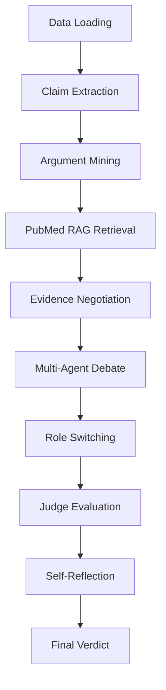

## Thesis Framework Pipeline – Complete Technical Overview (Comprehensive)

## Executive Summary

This document provides a **complete technical overview** of the Check-COVID thesis framework for COVID-19 claim fact-checking. It covers the entire **12-step pipeline** from dataset ingestion to final verdict generation, including:

* **Data shapes (I/O)** for each stage
* **PubMed RAG knowledge base** (FAISS + metadata seek)
* **Multi-Agent Debate (MAD)** with multi-provider LLM roles
* **Progressive RAG (P-RAG)** during debate rounds
* **Consistency testing via role switching**
* **Quantitative scoring + confidence computation**
* **Generated artifacts + file structure**

---

## Table of Contents

1. [System Architecture](#system-architecture)
2. [Dataset & Knowledge Base Structure](#dataset--knowledge-base-structure)
3. [Pipeline Architecture](#pipeline-architecture)
4. [Detailed Step-by-Step Execution](#detailed-step-by-step-execution)
5. [Metrics & Scoring Logic](#metrics--scoring-logic)
6. [Multi-Agent Debate System](#multi-agent-debate-system)
7. [File Structure & Artifacts](#file-structure--artifacts)
8. [How to Run](#how-to-run)

---

## System Architecture

The system executes a linear **12-Step Pipeline** (`main_pipeline.py`) orchestrating three layers:

1. **Data Layer**

* Check-COVID claims dataset
* PubMed RAG corpus (title + abstract), indexed in FAISS

2. **Agent Layer**

* Multiple LLM personas (Proponent, Opponent, Critic, Specialist roles)
* Providers can be mixed (Groq / OpenAI / Gemini), enabling cross-model diversity

3. **Orchestration Layer**

* Debate round management
* Evidence negotiation
* Progressive retrieval (P-RAG)
* Role switching
* Judge scoring
* Final confidence computation + artifact saving

### High-Level Data Flow (Mermaid)



---

## Dataset & Knowledge Base Structure

### 1) Claims Dataset (`Check-COVID_all.json`)

**Format:** JSONL (one JSON object per line)

**Example entry:**

```json
{
  "id": "60b83923f9b9e03ea4d8e6be_0",
  "claim": "One type of COVID-19 test identifies coronavirus proteins in a few seconds.",
  "cord_id": "8vp57c1o",
  "label": "REFUTE",
  "evidence_set": [{"sent_index": 1, "type": "PRIMARY"}],
  "is_auth": false
}
```

**Core fields**

* `id`: unique claim identifier
* `claim`: text statement to verify
* `label`: ground truth label (`SUPPORT` / `REFUTE`)
* `evidence_set`: dataset-provided evidence pointers (optional for evaluation)

---

### 2) PubMed Knowledge Base (RAG System)

**Purpose:** Provide external biomedical evidence for claims, primarily through **PubMed abstracts**.

**Storage format (FAISS + disk-seek metadata):**

* `pubmed_faiss.index` → FAISS vector index (**IndexFlatIP**, cosine via normalized embeddings)
* `pubmed_meta.jsonl` → metadata + chunk text (JSONL)
* `pubmed_meta_offsets.npy` → NumPy int64 offsets for O(1) disk seek into JSONL

**Embedding model (current):**

* `sentence-transformers/all-MiniLM-L6-v2`
* **Vector dimension:** 384 (so FAISS index dimension = 384)

**Metadata structure (per chunk):**

```json
{
  "pmid": "39496245",
  "doi": "10.1159/000541632",
  "title": "...",
  "year": "2024",
  "journal": "...",
  "url": "https://pubmed.ncbi.nlm.nih.gov/39496245/",
  "section": "RESULTS",
  "chunk_id": 0,
  "text": "Title...\n\nRESULTS: ... (abstract chunk)"
}
```

**Corpus creation pipeline (scripts):**

* `build_pubmed_corpus_sliced.py` → downloads PubMed records in safe slices
* `merge_pubmed_slices.py` → merges slice files
* `filter_years.py` → filters to target years (e.g., 2020–2024)
* `build_faiss.py` → chunks + embeds + builds index

---

## Pipeline Architecture

The pipeline is executed by `main_pipeline.py` and produces step-wise artifacts in `framework/`.

The design goal is **explainable fact-checking**:

* Evidence is explicitly retrieved and logged
* Debate is structured and saved
* Final verdict is derived from **scoring + consistency**, not “LLM vibes”

---

## Detailed Step-by-Step Execution

### Phase 1: Content Pre-processing

---

### **Step 1: Data Loading**

**Module:** `data_loader.py`
**Purpose:** Load claims from dataset and sample a claim for processing

**Input:**

* File path: `Check-COVID_all.json` (JSONL)

**Process:**

* Stream line-by-line
* Parse JSON
* Select a random claim (often within a limit, e.g., first 50, for testing diversity)

**Output:**

```python
Claim(id="...", text="...", metadata={"label": "REFUTE", ...})
```

**Saved artifacts:**

* `selected_claim.json`

---

### **Step 2: Preprocessing & Metadata Preservation**

**Module:** `preprocessing.py`
**Purpose:** Clean text while preserving ground truth metadata

**Input:**

* `Claim` object

**Process:**

* Strip whitespace / normalize
* Preserve label: `output.metadata = input.metadata`

**Output:**

* Cleaned `Claim` object

**Saved artifacts:**

* `preprocessed_claim.json`

---

### **Step 3: Argument Mining (Premise Decomposition)**

**Module:** `agent_workflow.py` → `ArgumentMiner`
**Purpose:** Convert a possibly complex claim into explicit premises

**Input:**

* claim text (string)

**LLM Provider (example):** Groq (`openai/gpt-oss-20b`) via `GroqLLMClient`

**Process:**

* Zero-shot / few-shot prompt to split claim into logical premises
* Output is a structured list

**Output:**

```python
Argument(claim_id="...", premises=["Premise 1", "Premise 2", ...])
```

**Saved artifacts:**

* `argument_mining.json`

---

### Phase 2: Retrieval (PubMed RAG)

---

### **Step 4: Large-Scale PubMed Retrieval**

**Module:** `rag_engine.py` → `PubMedRetriever`
**Purpose:** Retrieve biomedical evidence relevant to the claim

**Input:**

* Claim text (string)

**Retrieval mechanics:**

1. Encode query with SentenceTransformers → vector `Q`
2. FAISS `IndexFlatIP.search(Q, k=5)`
3. Convert ids → offsets (`pubmed_meta_offsets.npy`)
4. Disk seek into `pubmed_meta.jsonl` to read evidence chunks

**Output:**

```python
[
  Evidence(text="...", source_id="PMID:39496245", relevance_score=0.75, url="..."),
  ...
]
```

**Saved artifacts:**

* `evidence_pool.json`

---

### **Step 5: Evidence Negotiation (Evidence-First Debate Prep)**

**Module:** `agent_workflow.py` → `EvidenceFirstDebateAgent`
**Purpose:** Reduce hallucination by forcing debate to start from a shared evidence base

**Input:**

* top-k evidence pool (e.g., 5 items)

**Process:**

* Deterministic selection (current baseline: top-2 by relevance) **or**
* Agent-assisted selection (agents justify which evidence should be shared)

**Output:**

* Shared fact set:

```json
[
  {"source_id": "PMID:...", "text": "...", "relevance_score": 0.81},
  {"source_id": "PMID:...", "text": "...", "relevance_score": 0.79}
]
```

**Saved artifacts:**

* `shared_evidence.json`

---

## Phase 3: Multi-Agent Debate (MAD)

---

### **Step 6: Expertise Extraction & Persona Assignment**

**Purpose:** Dynamically assign expert personas based on the claim’s required expertise.

**Why dynamic assignment:**

* Different claims require different expertise
* “COVID test speed” → virologist + statistician
* “Vaccine efficacy” → immunologist + epidemiologist
* Fixed personas reduce relevance and increase noise

**Input:**

* Claim text
* Premises list (from Step 3)

**LLM Provider (example):** Google Gemini (`gemini-2.0-flash`)
*(Provider can be swapped; the interface remains the same.)*

**Process:**

1. **Analyze claim** with an expertise prompt:

   ```
   Analyze this claim and identify which scientific expertise domains are needed:

   Claim: [text]
   Premises: [list]

   Available domains:
   - epidemiologist: disease transmission, public health
   - virologist: viral structure, vaccines
   - statistician: clinical trials, data analysis
   - immunologist: immune response, antibodies

   Return JSON array: ["domain1", "domain2", ...]
   ```

2. Parse response → expertise domains

3. Assign personas from registry:

   ```python
   assigned_personas = ["epidemiologist", "virologist", "statistician", "critic"]
   ```

4. Validate persona set (unique roles, required critic present, etc.)

**Output:**

```json
{
  "claim": "One type of COVID-19 test identifies coronavirus proteins in a few seconds.",
  "required_expertise": ["epidemiologist", "virologist", "statistician", "critic"],
  "assigned_personas": ["epidemiologist", "virologist", "statistician", "critic"]
}
```

**Saved artifacts:**

* `persona_assignments.json`

**Implementation:** `expertise_extractor.py`

---

### **Step 7: Initialize Multi-Agent Debate (MAD) System**

**Purpose:** Create debate agents with distinct personas and (optionally) distinct LLM providers.

**Why multi-provider matters:**

* Reduces single-model bias
* Encourages perspective diversity
* Strengthens validity if different models converge
* Helps detect model-specific failure modes

**Multi-Provider Architecture (example configuration):**

|     Agent | Persona        | Provider | Model                | Temperature |
| --------: | -------------- | -------- | -------------------- | ----------: |
| Proponent | Epidemiologist | OpenAI   | gpt-4o-mini          |         0.7 |
|  Opponent | Virologist     | Groq     | llama-3.1-8b-instant |         0.6 |
|    Critic | Statistician   | Gemini   | gemini-2.0-flash     |         0.5 |
|    Expert | Immunologist   | Groq     | qwen/qwen3-32b       |         0.8 |

**Process:**

1. Create P-RAG engine:

   ```python
   prag = ProgressiveRAG(retriever, llm)
   ```

2. Initialize agents:

   ```python
   for persona_key in assigned_personas:
       persona_config = get_persona(persona_key)
       llm_client = create_llm_client(persona_config)
       agent = DebateAgent(persona_key, role, prag_engine)
   ```

3. Validate unique model/provider constraints:

   ```python
   validate_unique_models(assigned_personas)
   ```

**Output:**

* MAD orchestrator initialized with configured agents

**Implementation:**

* `personas.py` → persona registry + LLM factory
* `mad_system.py` → `DebateAgent`
* `mad_orchestrator.py` → `MADOrchestrator`
* `prag_engine.py` → `ProgressiveRAG`

---

### **Step 8: Run Multi-Round Debate with Progressive RAG (P-RAG)**

**Purpose:** Conduct structured debate with expert agents grounded in retrieved evidence.

**Debate structure per round:**

```
Round N:
  1) Proponent argues (supports claim)
  2) Opponent counters (refutes claim)
  3) Expert(s) analyze
  4) Critic evaluates
  5) (Optional) P-RAG triggers new retrieval to fill evidence gaps
```

**Core prompt pattern (example):**

```python
prompt = f"""
Claim: {claim.text}

Role: Argue in SUPPORT/AGAINST the claim.

Available Evidence:
{evidence_text}

Previous Arguments:
{history_text}

Generate your argument (2-3 paragraphs, cite evidence by source ID):
"""
```

#### Progressive RAG (P-RAG) in Round 2

**Why:** initial top-k retrieval may miss precise details; debate reveals what’s missing.

**Process:**

1. Agent requests targeted evidence gap
2. P-RAG formulates a retrieval query
3. Retrieve top-k additional evidence from FAISS
4. Inject new evidence into shared context
5. Log query + returned PMIDs

**P-RAG log entry example:**

```json
{
  "round": 2,
  "query": "COVID-19 diagnostic test detection time accuracy",
  "num_results": 3,
  "pmids": ["...", "...", "..."]
}
```

**Output (per round structure example):**

```json
{
  "round_number": 1,
  "arguments": [
    {"agent": "Dr. A", "role": "proponent", "persona": "epidemiologist", "text": "..."},
    {"agent": "Dr. B", "role": "opponent", "persona": "virologist", "text": "..."}
  ],
  "critiques": [{"agent": "Critic", "text": "..."}],
  "prag_triggered": false,
  "new_evidence": []
}
```

**Saved artifacts:**

* `debate_transcript.json`
* `prag_history.json`

**Implementation:** `mad_orchestrator.py` → `MADOrchestrator.run_full_debate()`

---

## Phase 4: Consistency & Verification

---

### **Step 9: Role-Switching & Consistency Testing**

**Purpose:** Test reasoning consistency by swapping roles and checking whether logic collapses.

**Why role switching:**

* Detects role bias (agents defending a side rather than evidence)
* Tests robustness (good reasoning survives role inversion)
* Adds a quantitative consistency adjustment to confidence

**Process:**

1. Swap roles:

   ```python
   agents['proponent'], agents['opponent'] = agents['opponent'], agents['proponent']
   ```

2. Run a short debate (2 rounds) using same claim + evidence

3. Consistency analysis compares original vs switched reasoning

4. Produce a consistency verdict

**Role adjustment rule:**

* Consistent → **+0.10** confidence
* Inconsistent → **−0.05** confidence

**Output:**

```json
{
  "claim_id": "...",
  "original_roles": {"proponent": "AgentA", "opponent": "AgentB"},
  "switched_roles": {"proponent": "AgentB", "opponent": "AgentA"},
  "consistency": "consistent",
  "notes": "..."
}
```

**Saved artifacts:**

* `debate_transcript_switched.json`
* `role_switch_report.json`

**Implementation:** `role_switcher.py` → `RoleSwitcher`

---

## Phase 5: Evaluation & Verdict

---

### **Step 10: Judge Evaluation**

**Module:** `judge_evaluator.py`
**Purpose:** Multi-judge scoring of debate quality and correctness

**Judges:**

* Logic judge
* Evidence judge
* Scientific judge

**Scoring:**

* Each judge scores both sides on criteria (0–10)

  * Evidence quality
  * Logical coherence
  * Scientific accuracy
  * Persuasiveness

**Output:**

* Aggregated scores:

```json
{
  "proponent_total": 85,
  "opponent_total": 80,
  "details": {...}
}
```

**Saved artifacts:**

* `judge_evaluation.json`

---

### **Step 11: Self-Reflection**

**Module:** `self_reflection.py`
**Purpose:** Winner critiques their own argument to surface weaknesses

**Penalty rule:**

* ReflectionPenalty ∈ [0, −0.15]
* Strong self-identified flaws reduce confidence (capped)

**Saved artifacts:**

* `self_reflection.json`

---

### **Step 12: Final Verdict Generation**

**Module:** `final_verdict.py`
**Purpose:** Produce final label + calibrated confidence using deterministic scoring

**Classification rule:**

* SUPPORT if ProponentScore > OpponentScore
* REFUTE if OpponentScore > ProponentScore

**Output:**

```json
{
  "verdict": "REFUTE",
  "confidence": 0.73,
  "reasoning": "...",
  "ground_truth": "REFUTE",
  "correct": true
}
```

**Saved artifacts:**

* `final_verdict.json`

---

## Metrics & Scoring Logic

Final verdict is driven by a **mathematical confidence formula**.

### Step 12 confidence formula

```python
Margin = abs(ProponentScore - OpponentScore) / TotalScore
BaseConfidence = Sigmoid(Margin * 2.0)
QualityBoost = min(1.0, TotalScore / 200) * 0.3
RoleBonus = +0.10 (if Consistent) OR -0.05 (if Inconsistent)
ReflectionAdj = ReflectionPenalty  # in [-0.15, 0]

FinalConfidence = BaseConfidence + QualityBoost + RoleBonus + ReflectionAdj
FinalConfidence = clamp(FinalConfidence, 0.0, 1.0)
```

### Interpretation bands

* **> 0.80:** Certainty
* **0.50–0.79:** High probability
* **0.20–0.49:** Ambiguous
* **< 0.20:** Unknown / toss-up

---

## Multi-Agent Debate System

### Agent roles

* **Proponent:** argues in support
* **Opponent:** argues against
* **Critic:** neutral critique, detects fallacies / misuse of evidence
* **Specialists:** e.g., Statistician / Immunologist / Epidemiologist

### Evidence grounding rule

Agents must cite evidence using:

* PMID / PubMed URL
* Evidence chunk text from retrieved abstract sections (RESULTS/CONCLUSION preferred)

---

## File Structure & Artifacts

### Key scripts

* `main_pipeline.py`
* `data_loader.py`
* `preprocessing.py`
* `agent_workflow.py`
* `expertise_extractor.py`
* `rag_engine.py`
* `prag_engine.py`
* `mad_orchestrator.py`
* `role_switcher.py`
* `judge_evaluator.py`
* `self_reflection.py`
* `final_verdict.py`

### RAG build scripts

* `build_pubmed_corpus_sliced.py`
* `merge_pubmed_slices.py`
* `filter_years.py`
* `build_faiss.py`
* `query_faiss.py`

### Output artifacts (typical run)

* `selected_claim.json`
* `preprocessed_claim.json`
* `argument_mining.json`
* `evidence_pool.json`
* `shared_evidence.json`
* `persona_assignments.json`
* `debate_transcript.json`
* `prag_history.json`
* `debate_transcript_switched.json`
* `role_switch_report.json`
* `judge_evaluation.json`
* `self_reflection.json`
* `final_verdict.json`

---

## How to Run

### Run the full 12-step pipeline

```powershell
python main_pipeline.py
```

### Build / query the PubMed RAG index

```powershell
python build_faiss.py --infile pubmed_covid_2020_2024_edat_upto_2024.jsonl.gz
python query_faiss.py --q "Do masks reduce COVID transmission?" --k 5
```

